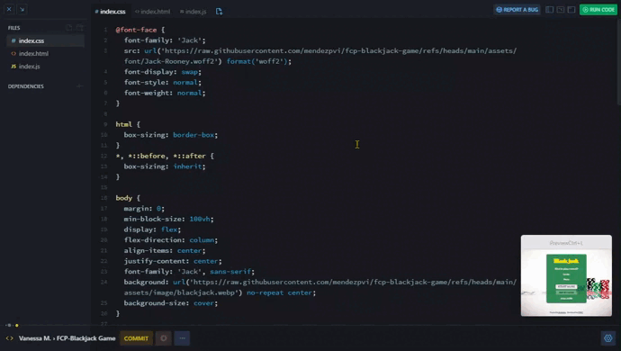

# Blackjack Game

## *Overview* 🧐

This project is part of the **Making Websites Interactive** module in the [**Frontend Career Path**](https://v2.scrimba.com/the-frontend-developer-career-path-c0j)  course by [**Scrimba**](https://v2.scrimba.com/home). The goal of the project is to build a basic interactive Blackjack game using HTML, CSS, and JavaScript, applying concepts learned in lectures.

## *Pseudocode* 📝

1. Variable Initialization:
    + Declare variables to store the game's state: cards, sum, player's status (active or not), and whether they have Blackjack.
1. Function to get a random card:
    + Generate a random number between 1 and 13.
    + Assign special values to cards like Ace (1 or 11) and face cards (J, Q, K).
1. Function to start the game:
    + Set the player's status to active.
    + Generate two random cards and calculate the initial sum.
    + Call the function to render the game interface.
1. Function to render the game interface:
    + Display the cards and the current sum.
    + Update the message according to the sum: offer a new card, declare Blackjack, or end the game.
1. Function to draw a new card:
    + If the player is still active, generate a new card and update the sum.
    + Call the function to render the game interface again.

## *Screenshots* 📷

## *Links* 🔗

[Scrim code](https://v2.scrimba.com/s0af9rdnko) 👈

[Live site](https://mendezpvi.github.io/fcp-blackjack-game/) 👈

## *What I learned* 🤓

✅ **Arrays**: To store and manage the player's cards.

✅ **Objects**: To store the player's name and chips.

✅ **Booleans**: To control the game's state (whether the player is active or has Blackjack).

✅ `If-else` statements: For the game logic and decisions based on the value of the sum.

✅ **Comparison operators**: To check if the player has Blackjack or has lost.

✅ **Logical operators**: To combine conditions.

✅ **`For` loops**: To iterate over the array of cards.

✅ **The `Math` object**: To generate random numbers and manipulate the values of the cards.

✅ **Return statements**: To return values in functions.

✅ **The `.disabled` property**: To enable or disable buttons depending on the game's state.

## *Resources* 🗃️

🗃️ Frontend Career Path by Scrimba

📖 [Enable/disable input button using JavaScript](https://www.delftstack.com/es/howto/javascript/javascript-disable-button/) by DelfStack (Spanish)

## *Author* 🔰

✨ Frontend Mentor - [@medezpvi](https://www.frontendmentor.io/profile/mendezpvi)

✨ X (formerly Twitter) - [@medezpvi](https://x.com/mendezpvi)